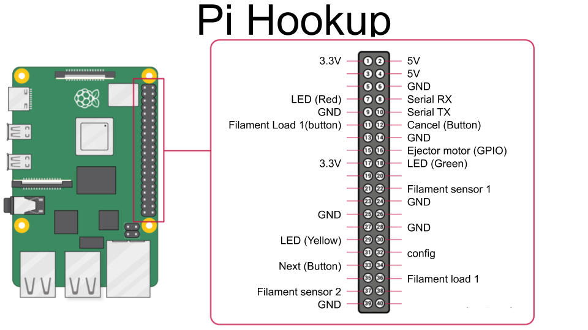

# autodrop3dClient
Client software for 3d printers interfacing with AutoDrop3D. This software will let you connect your printer to the https://autodrop3d.com cloud.

This is the client software for the autodrop3d printer system.
This software automatically retrieves gcode print jobs from the autodrop3d server and sends the gcode via serial to the printer connected to the raspberry pi.

There are additional features to make automatic part ejection possible by toggling the GPIO pins of the raspberry pi using wiringpi. It is also capable of using filament run out detectors with out any modifications to printer firmware.

#Instructions 
1) Hook up push buttons, LEDs and other items to GPIO header on the raspberry pi. 
    pin numbers are using the board pin header numbers for the raspberry pi
    

    A minimal setup dose not require all pins listed to be used. 

    | Required | Type   | Function        | pin # |
    |:--------:|--------|-----------------|-------|
    | NO       | Sensor | FilamentSensor1 | 22    |
    | NO       | Sensor | FilamentSensor2 | 37    |
    | YES      | Button | Config          | 32    |
    | NO       | Button | Cancel          | 12    |
    | YES      | Button | Next            | 33    |
    | NO       | Button | FilamentLoad1   | 36    |
    | NO       | Button | FilamentLoad2   | 11    |
    | NO       | Output | EjectorMotor    | 16    |
    | NO       | Output | LEDred          | 7     |
    | NO       | Output | LEDyellow       | 29    |
    | NO       | Output | LEDgreen        | 18    |
    | NO       | Serial | Serial TX       | 8     |
    | NO       | Serial | Serial RX       | 10    |
    |          |        |                 |       |
    

    
2) Download prebuilt raspberry pi image image from the following link
https://github.com/Autodrop3d/autodrop3dClient/releases/download/latest/autodrop3dimage-20201128.zip

3) Extract the ZIP file and use etcher (https://www.balena.io/etcher/) or similar softwar to write the image file to a 16gb sd card.

4) Boot the raspberry pi with the SD card.

5) Once booted press the config button. This will switch the raspberry pi in to wifi config mode and make the pi broadcast out a wifi access point.

6) Connect to the wifi network "autodrop3dConfig" with the password of "autodrop3d". Once connected goto http://192.168.4.1:8080

7) On the configuration page enter your wifi network credentials and save the configuration. Pres the config button connected to the pi to switch it back in to wifi station mode and connect to your local wifi. 

